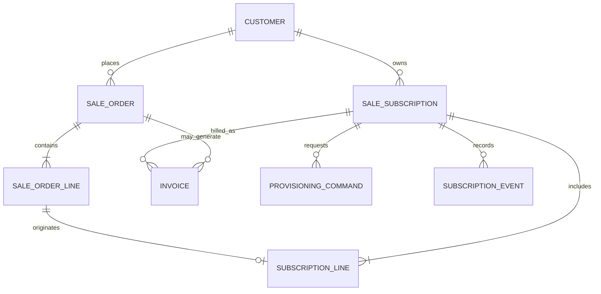
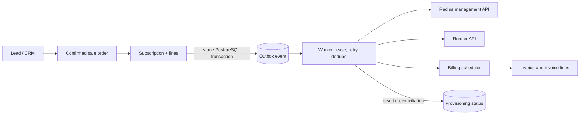

# ERP Architecture Review and Long-Term Blueprint

## Executive recommendation

Build `services/erp` as a modular monolith with an Odoo-like **extension experience** over SQLAlchemy 2.0, while keeping SQLAlchemy and Alembic in charge of persistence and schema evolution. The target should support addon dependencies, model extension (`_inherit`-like behavior), fields, constraints, methods/hooks, views/API metadata, permissions, and upgrade scripts without making a second general-purpose ORM.

Use two explicit extension modes. **Code addons** register typed fields, relationships, methods, and tables through a model registry during startup; code/schema changes go through generated/reviewed Alembic migrations. **Tenant custom fields** are metadata-driven and stored in a typed custom-value subsystem or constrained JSON payload; definitions can change without DDL, but are governed and cannot silently become core relational columns. This delivers the ergonomic part of Odoo's `_inherit` and custom fields while avoiding runtime production DDL and hidden monkey-patching.

Support both SQLite and PostgreSQL through a documented capability contract. SQLite is a first-class developer, test, demo, and small single-node deployment backend. PostgreSQL is the recommended production backend for concurrent workers, high availability, tenant scale, advanced indexing, and full database guarantees. The common addon/model API must work on both; optional advanced features are capability-gated and must declare their backend requirements. Do not claim transparent equivalence for locking, JSON indexing, enums, partial indexes, or concurrent job processing.

## Stack review

**Strengths:** Python/FastAPI is a productive fit for business workflows; Pydantic v2 provides clear API contracts; SQLAlchemy 2.0 supports explicit async persistence; PostgreSQL transactions, constraints, JSONB, and optional pgvector cover the likely core needs. The polyglot services can remain focused on AAA, workloads, gateway, and time.

**Risks and guardrails:** Async SQLAlchemy does not make blocking work safe; keep external calls out of request transactions and use a worker. Adopt Alembic from the first schema change, pin supported Python and dependency versions, and explicitly choose async drivers (`aiosqlite`, `asyncpg` or psycopg async) and migration workflows. `pgvector` is not a default ERP requirement; add it only for a concrete semantic-search use case. Financial amounts need currency and fixed-precision `NUMERIC`, never float. Store instants in UTC and billing timezone/calendar policy separately. SQLite has one-writer-at-a-time behavior and no PostgreSQL-equivalent `SELECT ... FOR UPDATE SKIP LOCKED`; use a serialized local worker/claim strategy there, and PostgreSQL for horizontally scaled workers.

| Pattern | Advantages | Costs / risks | Recommendation |
|---|---|---|---|
| Explicit registry over SQLAlchemy metadata/mapper | `_inherit`-like addon extension while retaining SQLAlchemy persistence | Registry/compiler is real framework code; must tightly constrain supported extension behavior | Recommended, with a deliberately small extension contract and no custom query language. |
| Metadata-driven DocType / JSONB | Flexible fields and forms, fast tenant-specific customization | Weaker database constraints, awkward joins/reporting, type/index complexity, migration burden moves into application | Use for bounded custom fields and low-criticality metadata; promote stable/high-value fields to typed schema through migrations. |
| Schema-first SQLAlchemy models | Constraints, joins, migrations, IDE/type support, predictable queries | Extension requires code and migrations; more up-front modeling | Keep as persistence foundation for core models and every field requiring strong integrity. |

### Odoo-like model extension design

Do not monkey-patch mapped SQLAlchemy classes after mapper configuration. Instead, compile addons into a **final model registry before the application creates the SQLAlchemy mappers**. Addon modules declare contributions; a deterministic loader resolves dependencies, validates collisions and produces the final SQLAlchemy `Table` objects, mapped classes, validators, metadata, and migration manifest. There is exactly one compiled registry per process/database schema version.

Illustrative addon declaration (conceptual API, not a promise to match Odoo syntax exactly):

```python
class CrmLead(Model):
    _name = "crm.lead"
    name = Field(str, required=True, index=True)
    stage_id = Many2One("crm.stage", ondelete="RESTRICT")

class SalesLeadExtension(Model):
    _inherit = "crm.lead"            # extend the existing model in-place
    expected_revenue = MoneyField(currency="company_currency")
    order_ids = One2Many("sale.order", inverse="opportunity_id")

    async def action_create_quote(self, context):
        ...
```

Semantics and rules:

1. `_name` creates a model; `_inherit` adds fields/methods to the existing model and does not create another table. If a distinct model reuses fields, call that composition/mixins explicitly; do not overload `_inherit` with several persistence meanings.
2. Addon declarations are data collected by an explicit manifest/entry-point loader, not arbitrary import side effects. Each addon declares `name`, semantic version, dependencies, supported ERP API version, migrations, and optional backend capabilities.
3. Dependency order is a DAG with deterministic topological ordering. Missing dependencies, cycles, duplicate field ownership, incompatible overrides, and unsupported API versions fail startup with an actionable error.
4. Fields have stable technical names, types, null/default rules, help/label metadata, index/constraint declarations, access policy, and an owner addon. Overrides require explicit `override=...` and compatibility checks; removing/renaming a field requires a migration/deprecation window.
5. Extensions of an existing table add columns or constraints to that table in the compiled metadata; addon-owned extension tables are preferred for optional/large subsystems. Every persistent change has a versioned migration. A migration planner can scaffold operations, but deployment applies reviewed migrations, never hidden auto-DDL.
6. Methods compose through explicit service hooks or cooperative `super()` on a controlled base, with deterministic method resolution order and tests. Event handlers are separate from model methods and use a transactional outbox for side effects.
7. Runtime registry is immutable after startup. Changing installed addons or code means migration plus controlled restart/rolling deployment. Tenant admins cannot upload executable Python addons.
8. Registry metadata powers forms, API schemas, permissions, audit labels, and documentation generation. API contracts still use explicit versioned Pydantic DTOs; database models are not automatically exposed as public APIs.

Tenant custom fields use a separate governed definition and value contract (`model`, `field_name`, `data_type`, validation schema, owner/tenant scope, searchable/index policy, lifecycle). For a small fixed common set, use JSON columns with application validation. For typed searchable custom values, use a table with separate typed value columns (`value_text`, `value_decimal`, `value_datetime`, `value_boolean`, `value_json`) and constraints ensuring exactly the matching value is set. Include tenant/model/record/field indexes. PostgreSQL may add targeted JSONB indexes; SQLite uses JSON functions where available or the generic value table. Never store passwords, secrets, financial ledger facts, tax bases, or high-integrity foreign keys as untyped custom JSON. The initial custom-field store is company-scoped and guards definition/value consistency, but core business rows do not yet carry `company_id`; it is not a row-level tenant-security boundary until tenant authorization and company ownership are completed.

This is intentionally a **bounded ERP model framework**, not a generic language for arbitrary ORM transformations. Define and version its extension contract before implementing addons. The advanced registry belongs after a thin vertical slice proves the needed extension cases; start with this contract and compile a small number of real models to validate it.

### SQLite / PostgreSQL contract

| Capability | SQLite | PostgreSQL |
|---|---|---|
| Core CRUD, FK, transactions, Alembic migrations | Supported; enable `PRAGMA foreign_keys=ON` on every connection | Supported |
| Local dev/test/demo and single-instance install | Recommended | Supported |
| Multi-process/high-concurrency API and distributed workers | Not recommended; serialize writes/worker claims | Recommended; row locking and concurrent claims |
| JSON custom fields | SQLite JSON support with portable application-level queries; avoid backend-specific index assumptions | JSONB, operators, GIN or targeted indexes where justified |
| Advanced indexes, exclusion constraints, advisory locks, pgvector | Unsupported/alternative implementation required | Optional PostgreSQL-specific addon capability |
| Financial decimal storage | SQLAlchemy `Numeric` plus `Decimal`; verify arithmetic in application and tests | `NUMERIC` with database constraints |
| Schema evolution | Alembic migrations, including batch table rebuild when necessary | Alembic migrations |

Keep portable core migrations and model types. Put backend-specific features behind named capabilities and addon migrations with clear fallback behavior. CI should run the common migration and domain suite on both backends; PostgreSQL-specific suites cover features SQLite cannot represent. Do not use SQLite production as a way to claim PostgreSQL-scale behavior.

## Commercial model and lifecycle

An order is a commercial agreement/snapshot of what was accepted. It can include one-off and recurring lines. Confirmation is the boundary for creating subscription commitments; the subscription is the operational lifecycle and can outlive the originating order. Store source order/line references for traceability, but do not make an active subscription a mutable view of its order. Amendments and renewals create versioned subscription-line changes or amendment records with effective dates.

Suggested subscription states: `draft -> pending_activation -> active -> past_due -> suspended -> active`, with terminal `cancelled` and `expired`. Keep payment status, provisioning status, and lifecycle status distinct. A pause should be an explicit `paused` state (with start/end and policy) or a suspension reason, not an overloaded cancellation. Transitions should be commands with authorization, timestamp, actor, reason, and an append-only history.

For mid-cycle changes, define policy per plan and persist it per amendment: immediate with credit/debit proration, next renewal, or scheduled. Compute credits and charges from exact interval boundaries (UTC instants) and a documented day-count basis. Round each invoice line at the currency's minor-unit precision, record the unrounded calculation inputs/rule version, and apply any residual deterministically. Do not silently rewrite historical invoice lines after a plan change.

Dunning should be a policy-driven sequence (attempt schedule, grace deadline, notices, suspend date, recovery behavior). Payment success during grace returns the subscription to `active`; suspension triggers provisioning intent. Cancellation should specify immediate versus end-of-period and whether already-earned charges remain due. Preserve a subscription lifecycle event/audit log.

## Minimal relational model



Core columns (all tables also have UUID primary key, `created_at`, `updated_at`, and suitable tenant scope if multi-tenant):

```text
sale_order
  number UNIQUE, customer_id FK, state [draft, sent, confirmed, cancelled],
  currency_code, order_date, confirmed_at, billing_address_snapshot JSONB,
  payment_terms_id nullable, source/reference nullable

sale_order_line
  order_id FK, sequence, product_id FK nullable, description_snapshot,
  quantity NUMERIC(18,6), unit_price NUMERIC(20,8), currency_code,
  tax/tax_category references, line_kind [one_off, recurring],
  billing_interval nullable, service_start/end nullable,
  subscription_policy/reference fields nullable

sale_subscription
  number UNIQUE, customer_id FK, source_order_id FK nullable,
  state, currency_code, billing_timezone, billing_anchor_local_date,
  current_period_start/end timestamptz, next_invoice_at timestamptz,
  trial_end_at nullable, grace_until nullable, cancel_at_period_end bool,
  cancelled_at nullable, version integer, dunning_policy_id nullable

subscription_line
  subscription_id FK, source_order_line_id FK nullable, product_id FK nullable,
  description_snapshot, quantity NUMERIC(18,6), unit_price NUMERIC(20,8),
  currency_code, billing_interval/unit, effective_from/to timestamptz,
  proration_policy, service_configuration JSONB, version integer
```

Add unique/exclusion constraints where useful (for example one active effective version per subscription/product dimension), checks for positive quantity and valid interval, and indexes for due billing and worker scans. `invoice` and immutable `invoice_line` should snapshot customer address, product text, tax basis, currency, service period, and calculation inputs; link invoices to source order/subscription as applicable. Add `subscription_event` and `outbox_event` in the initial implementation.

## Provisioning and failure recovery



Use a transactional outbox: write the subscription state change and one or more versioned domain events in the same database transaction. Workers claim rows with `FOR UPDATE SKIP LOCKED` (or an equivalent durable queue), use bounded exponential backoff with jitter, persist attempts/error/next-attempt, and dead-letter exhausted events for operator repair. Delivery is at least once; every command carries a stable idempotency key such as `subscription_id:desired_version:target`. Consumers persist that key and return the prior result on duplicate. Partition independent work by subscription or tenant where ordering matters. Never call a Go service inside the SQL transaction.

Prefer a small worker plus PostgreSQL outbox for the first release. Add a broker when volume, fan-out, or independent consumer needs justify operating it; retain the outbox as the atomic bridge from ERP commits. Publish desired state (`subscriber should be active at version N with profile X`) rather than fragile imperative sequences. Use a reconciliation loop to compare ERP's desired state with Radius/Runner's observed state and repair drift.

Current repository caveat: `services/radius` exposes subscriber/profile/session HTTP endpoints, including subscriber POST and session disconnect, but its `RadiusStore` is in-memory. Its disconnect handler accepts a session ID and sends PoD to the NAS; provisioning should not equate an HTTP success with confirmed NAS enforcement. `services/runner` exposes workload deploy/action endpoints, also with process-local state. Before production ERP integration, add durable state or idempotent desired-state command handling, authentication/service identity, request validation, timeouts, and observable operation IDs to both. For PoD, report accepted/sent/ACK-or-timeout outcomes separately. Protect RADIUS shared secrets and subscriber credentials; never emit them in event payloads or logs.

## Billing time and determinism

Use Gregorian civil billing anchors for money, invoices, payment deadlines, and tax. A lunar/celestial calendar is not a substitute for a legally recognized billing period. If the business explicitly offers a Hijri-aligned product, make that a separate named billing policy with persisted calendar/version and resolved UTC period boundaries.

For monthly billing, persist the anchor day and a short-month rule. A robust default is “same local day; clamp to the final day of shorter months, then restore the original anchor next month” (Jan 31 -> Feb 28/29 -> Mar 31), with timezone and daylight-saving behavior defined. Calculate periods in the customer's billing timezone, resolve boundaries to UTC, and use those frozen instants for invoices and proration. Store currency minor-unit exponent and use `Decimal`/PostgreSQL `NUMERIC`; specify the rounding mode and when rounding occurs. Keep MRR/ARR as derived reporting measures with a documented normalization convention; do not use them to alter invoice totals.

The MTS time service can provide Hijri/celestial display dates or explicitly selected calendar events. Core recurring billing should rely on a mature timezone database and ordinary UTC instants, not celestial time daemon availability. Do not use its current `/api/v1/time/now` floating Julian-day response to determine financial amounts or billing boundaries.

## Addon topology and rollout

Suggested dependency graph:

```text
base (customers, products, currencies, permissions, audit, outbox)
 ├── crm
 ├── sales -> crm (optional lead conversion integration)
 ├── subscription -> sales, base
 ├── isp -> subscription (provisioning adapter only)
 ├── project/workloads -> subscription (provisioning adapter only)
 └── accounting -> sales, subscription, base
```

Do not make `accounting` the final prerequisite for the whole ERP if sales/subscriptions need to work before accounting features mature. Instead, define a small invoice/payment interface in base or sales and let accounting provide posting, tax, receivables, and ledger implementations. Keep `isp` and `project` as adapters to external services, with no domain tables embedded into subscription core beyond generic service configuration/reference IDs. CRM should not be a hard dependency of sales if orders can originate from web/API/manual channels; make lead conversion an integration path.

Start with `base`, catalog/customer, sales, subscription, outbox worker, and invoice generation in one deployable service. Add adapter packages for Radius and Runner, then expand accounting as the statutory and reporting scope is clear. Use vertical migrations and versioned API/event contracts; avoid runtime DDL and circular addon imports.

## Decision summary

1. Use SQLAlchemy/Alembic as the persistence and migration foundation, with a bounded deterministic registry to provide code-addon `_inherit`-like extensions.
2. Permit governed tenant custom fields separately from code addons; do not let either silently mutate production schema.
3. Support SQLite and PostgreSQL with a tested common contract and explicit backend capabilities; use PostgreSQL for horizontally scaled production workloads.
4. Keep orders as accepted commercial snapshots and subscriptions as separate effective-dated service lifecycles.
5. Separate lifecycle, payment, and provisioning state; model transitions and amendments as auditable commands/events.
6. Use transactional outbox, idempotent desired-state commands, retries, and reconciliation for Go service integration.
7. Use Gregorian local billing anchors and UTC period instants for normal invoices; use MTS only for opt-in celestial-calendar features.
8. Keep addons as a DAG of packages and adapters; avoid hidden auto-DDL and circular addon imports.

## Delivery checklist

### Phase 0 — Product and framework contract

- [ ] Define v1 business scope, tenant model, roles, legal entities, currencies, tax jurisdictions, invoice numbering, and data retention.
- [x] Document the addon dependency DAG and supported `_name` / `_inherit` model-extension contract at an architectural level.
- [x] Specify `_inherit` extension semantics, conflict diagnostics, dependency ordering, and registry immutability; override compatibility and deprecation/removal policy remain open.
- [x] Define the SQLite/PostgreSQL capability matrix and supported deployment topologies.
- [x] Document money/time principles: Decimal/Numeric, UTC instants, billing timezones, anchor-day behavior, proration, and tax snapshots.

### Phase 1 — Thin foundation

- [x] Create `services/erp` with FastAPI, Pydantic v2, SQLAlchemy async, Alembic, SQLite/PostgreSQL drivers, and credential-encryption dependency declarations.
- [x] Add settings, health endpoint, versioned API prefix, and startup refusal when the configured database is not at Alembic head.
- [x] Require a configured minimum-32-character bearer key for production startup and protect API routes with constant-time token comparison; per-user identity, roles, and tenant authorization remain open.
- [x] Add sanitized request IDs (`X-Request-ID`) and structured JSON HTTP request logs with duration/status fields; request and response bodies are excluded.
- [x] Add optional OpenTelemetry FastAPI, HTTPX, and SQLAlchemy tracing with OTLP/HTTP export; verify span export, inbound W3C trace-context propagation, and JSON-log trace correlation using an in-memory exporter test.
- [ ] Add production per-user authentication/RBAC, tenant authorization, managed-secret provider integration, background-worker structured logs, telemetry metrics, and alerting.
- [x] Compile addon models, an `_inherit` extension, and addon-owned tables before database sessions are opened.
- [x] Validate dependency cycles/missing addons, duplicate model definitions, duplicate addon registration, field collisions, and undeclared extension ownership.
- [x] Implement deterministic dependency ordering, fail-fast field collision diagnostics, cooperative `_inherit` method resolution, and immutable compiled registry behavior; override compatibility and deprecation/removal policy remain open.
- [x] Add nine Alembic revisions: initial schema; encrypted credentials/outbox leases; legacy plaintext outbox secret redaction; persisted billing timezone/anchor; idempotent recurring invoice periods; explicit subscription transition audit fields; bounded quantity/probability constraints; posted-invoice snapshots, immutability, and state-transition guards; and tenant-scoped custom-field definitions/values.
- [x] Remove startup `create_all`; migrations are explicit and required before app startup.
- [x] Verify SQLite foreign-key enforcement, busy timeout, migration upgrade, Alembic metadata comparison, and existing row-count preservation.
- [x] Run the same migration/domain checks against a real PostgreSQL 18 instance; verify concurrent workers do not duplicate renewal invoices.

**Verified legacy database:** the repository `erp.db` was checked against the baseline schema on a copy, stamped at the verified baseline, and upgraded. Existing partner/order/subscription/invoice/outbox row counts were preserved; four historical outbox password values were removed.

**PostgreSQL environment check:** local PostgreSQL 18 and `asyncpg` are installed. The supplied password variants were rejected by the user's existing `erp_user` and `postgres` roles. To avoid changing that server or its credentials, a separate trust-authenticated PostgreSQL 18 cluster was initialized in a temporary directory and removed after verification. All nine Alembic revisions upgraded a fresh database; `alembic check` reported no drift; four renewal/payment/invoice-immutability/concurrent-worker workflow tests and the typed custom-field API/constraint test passed on the locked SQLAlchemy 2.0.54 runtime. The existing user-managed PostgreSQL database was not modified.

### Phase 2 — Core ORM-like developer experience

- [x] Compile typed scalar fields and Many2One foreign-key columns into SQLAlchemy metadata.
- [x] Map One2Many and Many2Many navigation into SQLAlchemy relationships; eager-load collections explicitly in async code.
- [x] Validate required fields, scalar types, string lengths, and selection choices in compiled model constructors; reject float inputs for Decimal fields.
- [x] Add field-declared numeric bounds compiled to DB check constraints and mirrored in model constructor validation for quantities, CRM probability, and billing anchor day.
- [x] Add read-only Python-computed and dotted-path related fields with dependency metadata.
- [x] Add cooperative addon model-validation hooks and reject missing required Many2One relationships before ORM flush.
- [x] Add deterministic registry diagnostics and an inspection API (`GET /api/v1/erp/models`) with addon dependencies and field owners.
- [x] Implement deterministic `_inherit` method composition through cooperative `super()`; verify extension order with a registry test.
- [ ] Add explicit, migration-aware compatible field override declarations; conflicting field names currently fail compilation.
- [x] Add governed company/model-scoped custom-field definitions and typed values in a separate typed value table; validate types/ranges, enforce company/model definition scope with a composite FK, and keep custom names out of core schema. Core row ownership and tenant-user authorization remain a Phase 5 gate.
- [x] Generate versioned Pydantic form metadata from safe registry fields and active tenant custom fields while keeping business request DTOs explicit.
- [ ] Add addon install/upgrade/uninstall lifecycle and destructive-change protection.

### Phase 3 — Commercial vertical slice

- [x] Preserve an initial customer/product/lead/order/subscription/invoice model set in SQLAlchemy.
- [x] Enforce a legal core subscription transition graph; record previous/new state, actor category, and reason in lifecycle events; wait for RADIUS acknowledgement before marking resumes active.
- [ ] Complete versioned subscription amendments, pause/resume policies, dunning, cancellation policy, and authenticated actor identity.
- [x] Calculate Gregorian billing boundaries from stored timezone and original local day; preserve month-end anchors across short months and DST gaps.
- [x] Add a Decimal elapsed-time proration utility with currency rounding and tests.
- [x] Integrate billing boundaries into a background renewal scheduler; persist invoice period/unique keys and advance subscriptions in the same transaction. The scheduler catches up due periods after downtime.
- [x] Snapshot customer details and commercial invoice lines; prevent header/line update or deletion after posting and enforce legal invoice state transitions in both SQLite and PostgreSQL while allowing payment-state updates.
- [x] Make invoice payment recording idempotent and conditional on the invoice still being posted/overdue.
- [ ] Implement tax, credit notes, statutory tax snapshots, currency-specific rounding policy, and failure/dunning rules.
- [x] Record business changes and outbox intents in the same transaction for the current activation/suspension flows.
- [x] Add outbox claim leases, retry scheduling with jitter, max-attempt dead letters, and manual retry state checks.
- [x] Allocate order/subscription/invoice numbers through a single database `UPDATE ... RETURNING` statement to avoid process-local sequence races.
- [ ] Prove duplicate delivery, crash recovery, and idempotency at the receiving Radius/Runner services; current idempotency header is not persisted by Go services.

### Phase 4 — Go service adapters

- [x] Keep HTTP side effects in a background dispatcher outside ERP business transactions; use the existing Radius subscriber/session routes and Runner workload routes.
- [x] Encrypt stored RADIUS credentials with a configured Fernet key, omit sensitive fields from model serialization/outbox monitoring, and redact historical plaintext outbox values by migration.
- [x] Keep ISP subscriptions pending activation until the Radius API acknowledges provisioning.
- [ ] Add authenticated, durable, idempotent desired-state command APIs to Radius and Runner; their stores are currently in-memory.
- [ ] Model accepted/applied/observed/failed provisioning states and truthful CoA send/ACK/timeout outcomes.
- [ ] Add Runner subscription provisioning, reconciliation, and operator repair tools.
- [ ] Document and implement Fernet key rotation with controlled re-encryption and internal-service TLS/authentication.

### Phase 5 — Reliability, security, scale, and operations

- [x] Run registry/security/billing workflow and transition/constraint unit coverage plus SQLite Alembic metadata check.
- [x] Smoke-test FastAPI health, model inspection, and partner serialization against the existing SQLite database.
- [ ] Add row-level tenant isolation (including company ownership on core records), per-tenant/user authorization, audit access controls, rate limiting, and security scans. Custom-field company scoping alone does not complete this gate.
- [ ] Exercise duplicate/out-of-order delivery, worker crashes, restarts, service outages, poison events, and recovery.
- [x] Run migration, domain, and concurrent renewal worker tests on an isolated PostgreSQL 18 cluster.
- [ ] Add backup/restore, monitoring/alerts, load targets, recovery objectives, deployment runbooks, and addon compatibility policy.

### Release gates

- [x] **SQLite prototype gate:** registry extension and Alembic migrations compile/apply; renewal billing duplicate prevention passes; no production runtime DDL; existing local rows preserved.
- [x] **PostgreSQL prototype gate:** migrations, metadata comparison, and concurrent renewal billing verified against an isolated real PostgreSQL instance.
- [ ] **MVP gate:** one-off and recurring order-to-invoice flow plus Radius/Runner provisioning verified end to end against durable, idempotent service contracts.
- [ ] **Production gate:** security, tax/accounting, backups, migrations, monitoring, reconciliation, and incident procedures reviewed and rehearsed.
- [ ] **Scale gate:** measured PostgreSQL performance and recovery objectives pass; SQLite remains within its documented single-node topology.

**Completed in this implementation pass:** deterministic addon ordering and validation; isolated registry metadata; Alembic startup enforcement and nine migrations; credential encryption/redaction; leased outbox claims; Decimal APIs; Gregorian billing boundaries, proration, and idempotent renewal scheduling; subscription transition audit; field bounds and cooperative model validation; computed/related fields; fail-closed production bearer-key enforcement; structured HTTP logs/request IDs; optional correlated FastAPI/HTTPX/SQLAlchemy tracing; company-scoped typed custom-field definitions, values, and versioned form metadata with runtime validation and database constraints; immutable posted-invoice snapshots; idempotent payment recording; and atomic numbering. Twenty-six local unit/integration tests pass (one PostgreSQL-only test is skipped without a configured test URL); PostgreSQL verification separately passes four billing workflow tests and one custom-field API/constraint test. Tax/accounting, core row-level tenant ownership/authorization, durable Go provisioning, and production operations remain open.

“More advanced than Odoo” remains a long-term product ambition. Close the checklist with tested behavior and measured operational results rather than treating architecture claims as completion.
